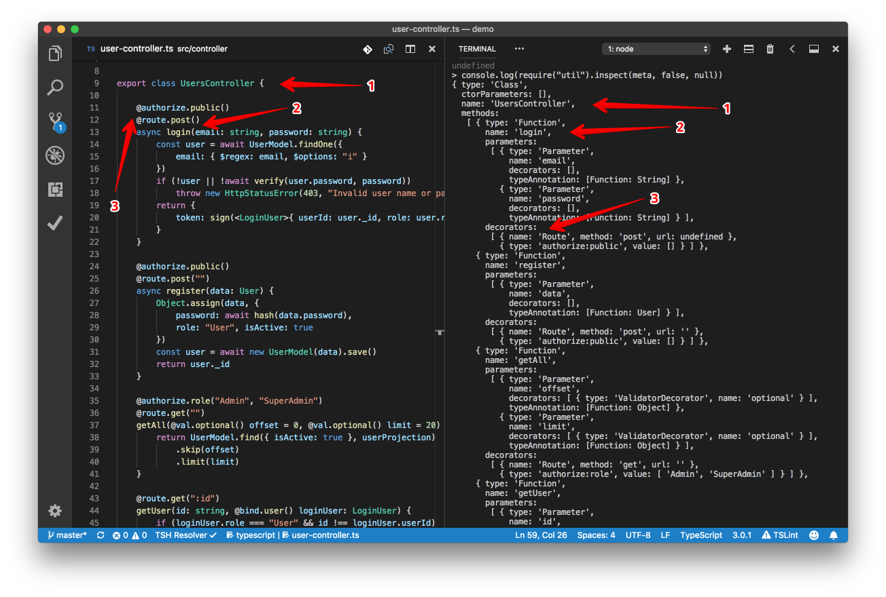

## Plumier
Delightful NodeJS Web Api Framework powered by KoaJs and TypeScript

---

I Ketut Sandiarsa

Developer VetVision

---

### Plumier
* Fokus pada *development happyness*
* Performance (KoaJS) [bit.ly/PlumBench](bit.ly/PlumBench)
* TypeScript

---

### Framework Sejenis
* LoopBack 4
* NestJS
* TypeStack/Routing Controller

---

### Fitur-fitur Plumier

---

### Dedicated Reflection Library



---

### Static Analysis


---

### Parameter Binding

```typescript
class UsersController {
  get(id:number, active:boolean, date:Date){

  }
}
```

```
GET /users/get?id=121&active=YES&date=2018-1-1
```

---

### Parameter Binding 

```typescript
class UsersController {
  @route.post()
  login(username:string, password:string){

  }
}
```

```
POST /users/login
request body:
{ username: "johndoe", password: "secret123" }
```

---

### Domain Model Binding

```typescript
@domain()
class Auth {
  constructor(
    public username:string, 
    public password:string
  ){}
}

class UsersController {
  @route.post()
  login(data:Auth){

  }
}
```
---

### Built-in Validation

```typescript
@domain()
class User {
  constructor(
    public name:string,
    @val.email()
    @val.unique()
    public email:string,
    @val.before()
    public birthDate:Date,
    public address:string,
  ){}
}
```

@[5-6,8](Decorator validation)

---

### Built-In Authorization

```typescript
class UsersController {
  @authorize.public()
  @route.post()
  login(username:string, password:string){
    //other logic
    return {
      token: sign({id, role}, SECRET)
    }
  }

  @authorize.role("SuperAdmin")
  @route.post()
  deactivate(id:string){

  }
}
```

@[2-9](GET /users/login)
@[7](Setup authorization)
@[11-15](GET /users/deactivate)
---

### Parameter Authorization

```typescript
@domain()
class User {
  constructor(
    public name:string,
    public email:string,
    public address:string,
    @authorize.role("Admin", "SuperAdmin")
    public isActive:boolean,
    @authorize.role("SuperAdmin")
    public role: "User" | "Admin" | "SuperAdmin"
  ){}
}
```
@[7,9](Authorization)
---

### Mongoose Helper 

```typescript
@collection()
class User {
  constructor(
    public name:string,
    public email:string,
    public address:string,
    @authorize.role("Admin", "SuperAdmin")
    public isActive:boolean,
    @authorize.role("SuperAdmin")
    public role: "User" | "Admin" | "SuperAdmin"
  ){}
}

const UserModel = model(User)
```

@[1](Decorator penanda)
@[14](Membuat instance Mongoose model)
---

### Optional Dependency Injection

```typescript
export class Resolver implements DependencyResolver {
    container: Container
    constructor(){
        const container = new Container()
        container.register(PetRepository)
        container.register(ClientRepository)
        container.register(ClientController)
        container.register(ClientPetController)
        this.container = container
    }
    resolve(type: Class) {
        return this.container.resolve(type)
    }
}

new Plumier()
    .set(new RestfulApiFacility())
    .set({ dependencyResolver: new Resolver() })
    .initialize()
    .then(x => x.listen(8000))
    .catch(x => console.error(x))
```
@[1](Custom resolver)
@[4-8](Component registration)
@[18](Composition root)
---


