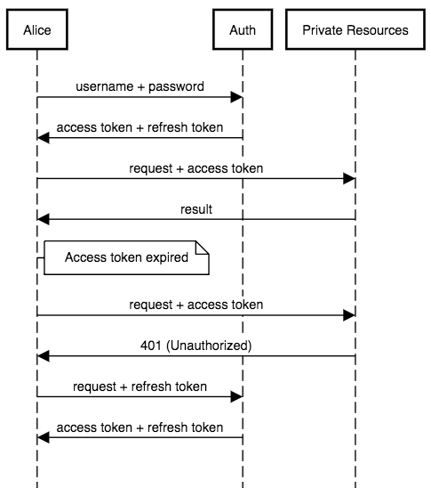

## Plumier
Delightful NodeJS Web Api Framework powered by KoaJs and TypeScript

---

I Ketut Sandiarsa

Developer VetVision

---

### Plumier
* 
* Fokus pada *development happiness*
  * Built-in validation
  * Built-in authorization
* Mebuat web api dengan cepat robust dan aman, tanpa bantuan generator
* Performance (KoaJS) [bit.ly/PlumBench](https://bit.ly/PlumBench)

---

### Framework Sejenis
* LoopBack 4
* NestJS
* TypeStack/Routing Controller

---

### Fitur-fitur Plumier

---

### Dedicated Reflection Library


---

### Static Analysis


---

### Parameter Binding

```typescript
class UsersController {
  @route.get()
  get(id:number, active:boolean, date:Date){

  }
}
```

```
GET /users/get?id=121&active=YES&date=2018-1-1
```

---

### Parameter Binding 

```typescript
class UsersController {
  @route.post()
  save(id:number, active:boolean, date:Date){

  }
}
```

```
POST /users/save
body:
{ "id": "123", "active": "YES", "date":"2018-1-1" }
```

---

### Domain Model Binding

```typescript
@domain()
class Domain {
  constructor(
    public id:number, 
    public active:boolean, 
    public date:Date
  ){}
}

class UsersController {
  @route.post()
  save(type:string, @bind.body() data:Domain){

  }
}
```

```
POST /users/save?type=car
body:
{ "id": "123", "active": "YES", "date":"2018-1-1" }
```
---

### Built-in Validation

```typescript
@domain()
class User {
  constructor(
    public name:string,
    @val.email()
    @val.unique()
    public email:string,
    @val.before()
    public birthDate:Date,
    public address:string,
  ){}
}
```

@[5-6,8](Decorator validation)

---

### Built-in Validation

```typescript
class UsersController {
  @route.get()
  get(@val.mongoId() id:string){

  }
}
```

---

### Built-In Authorization

```typescript
class UsersController {
  @authorize.public()
  @route.post()
  login(username:string, password:string){

  }

  @authorize.role("SuperAdmin")
  @route.post()
  deactivate(id:string){

  }
}
```
---

### Parameter Authorization

```typescript
@domain()
class User {
  constructor(
    public name:string,
    public email:string,
    public address:string,
    @authorize.role("Admin", "SuperAdmin")
    public isActive:boolean,
    @authorize.role("SuperAdmin")
    public role: "User" | "Admin" | "SuperAdmin"
  ){}
}
```
@[7,9](Authorization)
---

### Mongoose Helper 

```typescript
@collection()
class User {
  constructor(
    public name:string,
    public email:string,
    public address:string,
    @authorize.role("Admin", "SuperAdmin")
    public isActive:boolean,
    @authorize.role("SuperAdmin")
    public role: "User" | "Admin" | "SuperAdmin"
  ){}
}

const UserModel = model(User)
```

@[1](Decorator penanda)
@[14](Membuat instance Mongoose model)
---

### Optional Dependency Injection

```typescript
export class Resolver implements DependencyResolver {
    container: Container
    constructor(){ /* Registration */    }
    resolve(type: Class) {
        return this.container.resolve(type)
    }
}

```
```typescript
//entry point
new Plumier()
    .set(new RestfulApiFacility())
    .set({ dependencyResolver: new Resolver() })
    .initialize()
    .then(x => x.listen(8000))
    .catch(x => console.error(x))
```
---

### Contoh Autentikasi API dengan Refresh Token

* Social Auth Facebook
* Autorisasi
* MongoDB

---

### Pengamanan API dengan JWT 


---
### Kenapa Perlu Refresh Token?

* Token bisa di curi dengan traffic sniffing atau MITM
* Long lived token yang sudah di curi memungkinkan attacker memakai token dalam jangka waktu yang lama.

---

### Refresh Token



---
### Routes

| Route                | Access                  |
| -------------------- | ----------------------- |
| `GET /auth/facebook` | public                  |
| `GET /auth/refresh`  | AccessToken             |
| `GET /users`         | Admin, SuperAdmin       |
| `GET /users/me`      | User, Admin, SuperAdmin |

---
### Spesifikasi

* Refresh token tidak boleh digunakan untuk mengakses private resource
* Access token tidak boleh digunakan untuk mengakses /auth/refresh

---
### Implementasi

---?code=demo/package.json&lang=json&title=package.json

---?code=demo/tsconfig.json&lang=json&title=tsconfig.json

---?code=demo/src/controller/auth-controller.ts&lang=typescript&title=Auth Controller
@[19-29](Facebook login)
@[10-17](Membuat token)
@[31-37](Refresh token)

---?code=demo/src/controller/users-controller.ts&lang=typescript&title=Users Controller
@[5-18](Private resources)

---?code=demo/src/model/user.ts&lang=typescript&title=Domain Model

---?code=demo/src/index.ts&lang=typescript&title=Entry Point
@[7](Install restful functionalities)
@[8-10](Install mongoose functionalities)
@[11-14](Install jwt authorization functionalities)